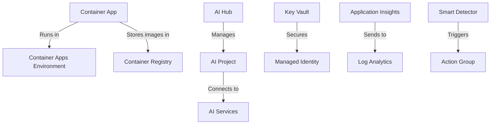

# cursor-fun <!-- omit in toc -->

- [Requirements](#requirements)
  - [Azure Setup](#azure-setup)
- [Azure Deployment Architecture](#azure-deployment-architecture)
  - [Key Relationships](#key-relationships)
  - [Monitoring \& Security Components](#monitoring--security-components)
- [Getting Started](#getting-started)
- [Cursor](#cursor)
  - [Modes](#modes)
  - [Features](#features)
- [Exercises](#exercises)
  - [Applicative Features](#applicative-features)
  - [Project Features](#project-features)


A simple project to learn how to use cursor.

This is a monorepo project, we'll start with a simple python project and then add more projects to it.

## Requirements

- [make](https://www.gnu.org/software/make/) 😁
- [Cursor](https://www.cursor.com/) - The AI Code Editor
- [Docker Desktop](https://docs.docker.com/get-started/introduction/get-docker-desktop/)
- Read the `README.md` file os each project to see the requirements for each project. For example, see [azureai-basic-python/README.md](azureai-basic-python/README.md) for the requirements for the azureai-basic-python project.

### Azure Setup

Some projects require you to setup Azure.

1. [Register for an Azure account](https://azure.microsoft.com/en-us/pricing/purchase-options/azure-account) and create a Pay As You Go subscription.
1. [Login to Azure](https://docs.cursor.com/azure/login)
   ```bash
   make azure-login
   ```
2. Provision and deploy all the resources
   ```bash
   make azure-up
   ```
3. Delete the resources when you are done with the project
   ```bash
   make azure-down
   ```


## Azure Deployment Architecture

<details>
<summary>Click to expand</summary>

When deployed to Azure using `make azure-up`, the following resources are created:

| Resource | Purpose | Key Features |
|----------|---------|--------------|
| **Azure AI Hub** | Central AI management | Coordinates AI services, manages connections |
| **Azure AI Project** | Workspace configuration | Organizes resources for specific AI applications |
| **Azure OpenAI Service** | Language processing | Provides GPT models for chat/completions |
| **Key Vault** | Secret management | Securely stores API keys and credentials |
| **Container Apps** | Application hosting | Runs your Python API in serverless containers |
| **Managed Identity** | Secure access | Provides automatic credentials for Azure resources |
| **Application Insights** | Monitoring | Tracks application performance and errors |
| **Log Analytics** | Centralized logging | Aggregates logs from all services |

**Security Features**:
- Automatic secret management via Key Vault
- Managed Identity for service authentication
- Secure connections between AI services
- Built-in monitoring and alerting

### Key Relationships
1. Container App uses Managed Identity to access:
   - Azure OpenAI for AI processing
   - Key Vault for secure credentials
2. AI Hub manages connections between:
   - Storage Account (file storage)
   - AI Services (model endpoints)
3. Monitoring flows to:
   - Application Insights → Log Analytics → Action Groups

### Monitoring & Security Components

| Resource | Purpose |
|----------|---------|
| **Action Group** | Defines notification channels (email/SMS) for alerts |
| **Smart Detector Alert Rule** | Automatically detects application anomalies |
| **Container Registry** | Private repository for Docker images |
| **Container Apps Environment** | Secure platform for running containers |

**Full Resource Map:**

</details>   

## Getting Started

This section is for running the project locally.

1. Copy `env` to `.env` and update the `PROJECT_NAME`
   ```bash
   cp env .env
   ```

   ```
   PROJECT_NAME=azureai-basic-python
   ```
1. Copy `${PROJECT_NAME}/env` to `${PROJECT_NAME}/.env`
   ```bash
   cp ${PROJECT_NAME}/env ${PROJECT_NAME}/.env
   ```

    ```
    USE_SEARCH_SERVICE=false
    USE_APPLICATION_INSIGHTS=true
    USE_CONTAINER_REGISTRY=true
    SUBDIR=src
    PYTHON_SCRIPT=main.py
    REQUIREMENTS_FILE_PATH=src/requirements.txt
    ```

2. Prepare the [virtual environment](https://docs.python.org/3/library/venv.html)
   ```bash
   make prepare
   ```
3. Install Python packages on the virtual environment
   ```bash
   make install
   ```
4. Run the application locally
   ```bash
   make run
   ```

## Cursor

### Modes

- [Chat](https://docs.cursor.com/chat/overview) (<kbd>CMD</kbd> + <kbd>Shift</kbd> + <kbd>L</kbd>) - Like ChatGPT, but with the option to provide context from the codebase.
  - Supported models - Any, including Deepseek R1 🙂
- [Composer](https://docs.cursor.com/composer/overview) (<kbd>CMD</kbd> + <kbd>I</kbd>) - Local AI agent that can read, write and run code.
  - Supported models
    - **Claude 3.5 Sonnet** - `claude-3-5-sonnet-20241022`
    - **Chat GPT 4o** - `gpt-4o`
  - Modes
    - `normal` - Normal mode, where the agent will read and edit code.
    - `agent` (**Preferred**) - Agent mode, where the agent will read, write and run code. If running in YOLO mode, the agent will run commands without prompting (e.g. `make run`).

### Features

- [Context](https://docs.cursor.com/context/@-symbols/basic) - Files, Folders, Docs, etc.
- [Cursor Rules](https://docs.cursor.com/context/rules-for-ai) - See examples [awesome-cursorrules](https://github.com/PatrickJS/awesome-cursorrules)
- [MCP](https://modelcontextprotocol.io/introduction) - Model Context Protocol - "..MCP provides a standardized way to connect AI models to different data sources and tools." See examples [MCP Servers](https://github.com/modelcontextprotocol/servers)

## Exercises

### Applicative Features

1. History of conversations
   - **Definition of done** - Enable end-users to see the history of conversations, just like ChatGPT, and continue the conversation.
   - TIP: Use [localStorage](https://developer.mozilla.org/en-US/docs/Web/API/Window/localStorage) to store the history of conversations, as we don't want to use a database for this project.
2. Allow removal of conversations
   - **Definition of done** - Enable end-users to remove a conversation from the history.
3. Allow renaming of conversations
   - **Definition of done** - Enable end-users to rename a conversation.
4. Print used tokens per conversation
   - **Definition of done** - Print the number of tokens used per conversation.

### Project Features

2. Docker build and push
   - **Definition of done** - `make docker-build` and `make docker-run` locally - http://localhost:8004
   - Update the [Dockerfile](azureai-basic-python/src/Dockerfile) to be a state of the art Dockerfile.
   - Update the [Makefile](Makefile) to build the Docker image and run the container.
3. Azure Deployment
   - **Definition of done** - `make azure-push` and `make azure-deploy` - update image tag from `azd-deploy-1738301240` to `azd-deploy-fun` and validate in Azure Portal
   - Add a command for `make azure-push` to push the Docker image to the Azure Container Registry.
   - Add a command for `make azure-deploy` to deploy the Docker image to the Azure Container Registry.
